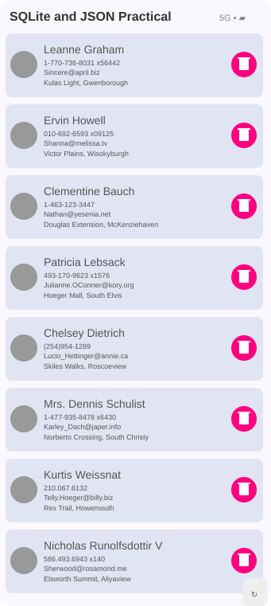
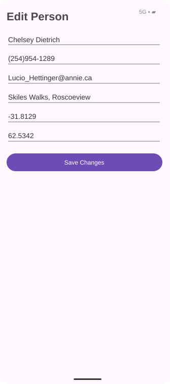

# 📱 Practical-7 — JSON API & SQLite Database

## 🎯 Aim

Develop an Android application that retrieves person data in JSON format from an Internet API, displays the records, and stores the retrieved data in an SQLite database.

## 📌 Features

- Retrieve person/contact data from an Internet JSON API
- Parse JSON data into `Person` objects
- Display records in a ListView with card-style rows
- Store and update records locally in SQLite
- Refresh data from the API
- Edit person details
- Delete person records
- Preserve edited data in the local SQLite database
- Display name, phone, email, address, latitude and longitude

## 📸 Screenshots

### Main Screen



### Edit Person Screen



## 🔄 Application Flow

```text
Internet API
     ↓
JSON Response
     ↓
HttpURLConnection
     ↓
JSON Parsing
     ↓
Person Objects
     ↓
SQLite Database
     ↓
ListView / Adapter
     ↓
Display Person Data
     ↓
Tap Record → EditActivity → Update SQLite
```

## 🧩 Main Components

### Person

A Serializable `Person` data class stores:

- ID
- Name
- Phone Number
- Email ID
- Address
- Latitude
- Longitude

### HttpRequest

`HttpURLConnection` communicates with the online JSON API and retrieves the person data.

### MainActivity

- Loads saved records from SQLite when the application opens
- Displays records using a ListView
- Refreshes data from the API
- Updates the list after editing or deleting a record

### PersonAdapter

The adapter displays each person in a card-style row. Tapping a record opens the edit screen, while the delete button removes that record from SQLite.

### EditActivity

The selected person's existing information is loaded into editable fields. After pressing **Save Changes**, the updated name, phone, email, address, latitude and longitude are stored in SQLite and the main list is refreshed.

### DatabaseHelper

SQLite is used for local storage with CRUD operations:

- Insert / Upsert
- Read all records
- Update a record
- Delete a record
- Clear records

## 🔄 Refresh Operation

```text
Click Refresh
     ↓
HTTP GET Request
     ↓
Receive JSON Response
     ↓
Parse JSON
     ↓
Create Person Objects
     ↓
Upsert into SQLite
     ↓
Reload ListView
```

## ✏️ Edit Operation

```text
Tap Person Record
       ↓
Open EditActivity
       ↓
Load Existing SQLite Data
       ↓
Edit Name / Phone / Email / Address / Location
       ↓
Save Changes
       ↓
Update SQLite Record
       ↓
Return to MainActivity
       ↓
Display Updated Record
```

## 🗑️ Delete Operation

The delete button on each record removes the selected person from the SQLite database and immediately refreshes the displayed list.

## 🌐 JSON Data

The application uses an Internet JSON API and maps its user/address/geo fields into the `Person` model.

## 🔐 Internet Permission

```xml
<uses-permission android:name="android.permission.INTERNET" />
```

## 📚 Concepts Covered

- JSON Format
- JSON Parsing
- Internet API
- HTTP Communication
- HttpURLConnection
- ListView
- Adapter
- SQLite Database
- CRUD Operations
- Serializable
- Android Manifest
- API Communication
- Local Data Storage

## 📂 Project Structure

```text
24012011013_MAD_PRACTICAL7
│
├── app/
│   └── src/main/
│       ├── AndroidManifest.xml
│       ├── java/com/example/mad_24012011013_practical7/
│       │   ├── MainActivity.kt
│       │   ├── Person.kt
│       │   ├── PersonAdapter.kt
│       │   ├── DatabaseHelper.kt
│       │   ├── HttpRequest.kt
│       │   └── EditActivity.kt
│       └── res/layout/
│           ├── activity_main.xml
│           ├── activity_edit.xml
│           └── single_item.xml
│
├── screenshots/
│   ├── practical7_main_screen.svg
│   └── practical7_edit_screen.svg
│
├── build.gradle.kts
├── gradle.properties
├── gradlew
├── gradlew.bat
├── settings.gradle.kts
└── README.md
```

## 🛠️ Technologies Used

| Technology | Purpose |
|---|---|
| Kotlin | Android application development |
| Android Studio | Development environment |
| Android SDK | Android application development |
| JSON | Data exchange format |
| HttpURLConnection | API communication |
| ListView | Displaying person records |
| Adapter | Binding data to the list |
| SQLite | Local database storage |
| Git & GitHub | Version control |

## ▶️ How to Run

1. Clone the repository.
2. Open the project in Android Studio.
3. Allow Gradle synchronization to complete.
4. Connect an Android device or start an Android Emulator.
5. Make sure the device has an active Internet connection.
6. Run the application.
7. Tap **Refresh** to retrieve the latest API data.
8. Tap any person record to edit it.
9. Press **Save Changes** to store the updated record.
10. Use the delete button to remove a record.

## ✅ Result

The Android application demonstrates JSON API communication, JSON parsing, ListView display, SQLite local storage, refresh, edit/update, and delete operations. Edited records are saved to SQLite and are displayed with the updated information when returning to the main screen.

---

**Subject:** Mobile Application Development (MAD)  
**Practical:** 7  
**Topic:** JSON API & SQLite Database  
**Language:** Kotlin  
**Platform:** Android
